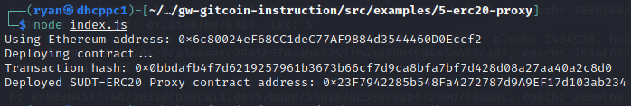
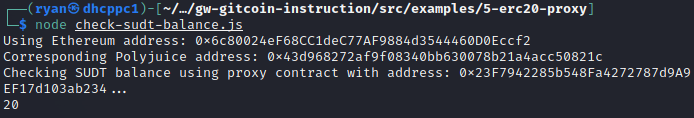

1)A screenshot of the console output immediately after deploying smart contract.

2)The address of the ERC20 Proxy Contract you deployed (in text format).
```
0x23F7942285b548Fa4272787d9A9EF17d103ab234
```
3)A screenshot of the console output immediately after checking your SUDT balance.

4)The Ethereum address that was checked (in text format).
```
0x6c80024eF68CC1deC77AF9884d3544460D0Eccf2
```
